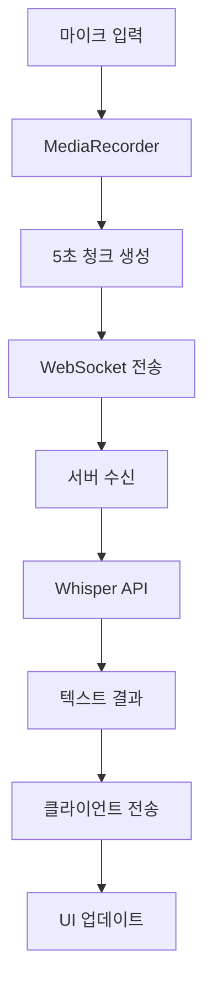
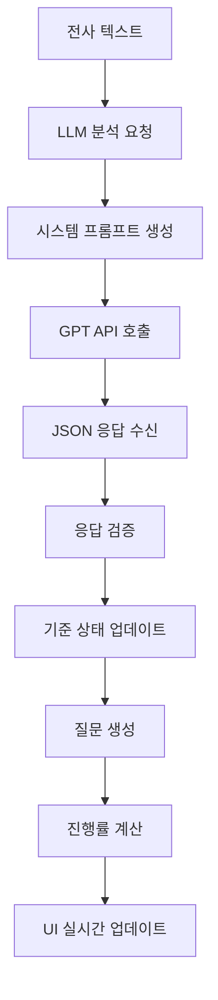

# 실시간 면접 코파일럿 상세 구현 가이드 (초보자용)

> 이 문서는 웹 개발 초보자를 위해 모든 기술 용어와 개념을 상세히 설명합니다.
> 각 코드 블록마다 해당 파일 위치와 라인 번호를 참조하여 실제 소스코드를 확인할 수 있습니다.

## 용어 설명 (Glossary)

### 웹 개발 기본 용어
- **컴포넌트(Component)**: React에서 UI의 독립적인 조각. 재사용 가능한 코드 블록
- **훅(Hook)**: React 함수형 컴포넌트에서 상태와 생명주기를 관리하는 함수 (useState, useEffect 등)
- **상태(State)**: 컴포넌트 내부에서 변경될 수 있는 데이터
- **프롭스(Props)**: 부모 컴포넌트에서 자식 컴포넌트로 전달하는 데이터
- **API**: 서로 다른 소프트웨어가 통신하기 위한 규칙과 방법
- **WebSocket**: 실시간 양방향 통신을 위한 프로토콜 (HTTP와 달리 연결이 지속됨)

### AI/ML 관련 용어
- **STT (Speech-to-Text)**: 음성을 텍스트로 변환하는 기술
- **LLM (Large Language Model)**: GPT와 같은 대형 언어 모델
- **프롬프트(Prompt)**: AI에게 주는 지시사항이나 질문
- **토큰(Token)**: AI가 텍스트를 처리하는 최소 단위 (단어보다 작을 수 있음)
- **Whisper**: OpenAI에서 개발한 음성 인식 AI 모델

### 오디오 처리 용어
- **MediaRecorder**: 브라우저에서 오디오/비디오를 녹음하는 API
- **Blob**: Binary Large Object, 이진 데이터를 담는 객체 (오디오 파일 등)
- **청크(Chunk)**: 큰 데이터를 작은 조각으로 나눈 것
- **샘플링 레이트**: 1초당 오디오 신호를 측정하는 횟수 (Hz 단위)

## 목차
1. [전체 시스템 개요](#전체-시스템-개요)
2. [프론트엔드 UI 구현](#프론트엔드-ui-구현)
3. [백엔드 서비스 구현](#백엔드-서비스-구현)
4. [데이터 플로우 상세 분석](#데이터-플로우-상세-분석)
5. [환경 설정 및 배포](#환경-설정-및-배포)

---

## 전체 시스템 개요

### 시스템 아키텍처
```
[마이크] → [오디오 캡처] → [청크 생성] → [WebSocket] → [Whisper API] → [텍스트]
                                                            ↓
[UI 업데이트] ← [WebSocket] ← [결과 반환] ← [GPT 분석] ← [텍스트 + 평가 기준]
```

### 기술 스택
- **프론트엔드**: Next.js 15, React, TypeScript, Tailwind CSS
- **백엔드**: Node.js, Express, WebSocket, TypeScript
- **AI 서비스**: OpenAI Whisper (STT), GPT-4o-mini (분석)
- **통신**: WebSocket (실시간), REST API (설정)

---

## 프론트엔드 UI 구현

### 1. 메인 페이지 레이아웃 (`src/app/page.tsx`)

#### 전체 구조 이해
```typescript
export default function Home() {
  // 상태 관리
  const [template, setTemplate] = useState<InterviewTemplate | null>(null);
  const [copyFeedback, setCopyFeedback] = useState<string | null>(null);
  
  // 커스텀 훅 사용
  const { isConnected, transcriptions, ... } = useWebSocket();
  const { isRecording, hasPermission, ... } = useAudioCapture();
```

**왜 이렇게 구성했나요?**
- `useState`: 컴포넌트 내부 상태를 관리합니다.
- 커스텀 훅: 복잡한 로직을 재사용 가능한 단위로 분리합니다.

#### 3분할 레이아웃 구조
```typescript
<main className="flex-1 flex overflow-hidden">
  {/* 좌측: 실시간 텍스트 스트림 (1/3) */}
  <div className="w-1/3 bg-white border-r p-6">
    <Transcript transcriptions={transcriptions} isRecording={isRecording} />
  </div>

  {/* 중앙: 평가 기준 카드들 (1/3) */}
  <div className="w-1/3 bg-gray-50 p-6">
    <CriteriaBoard criteria={template?.criteria || []} progress={progress} />
  </div>

  {/* 우측: 제안 질문 패널 (1/3) */}
  <div className="w-1/3 bg-white border-l p-6">
    <NextQuestions questions={nextQuestions} onCopyQuestion={handleCopyQuestion} />
  </div>
</main>
```

**CSS 클래스 설명:**
- `flex-1`: 남은 공간을 모두 차지
- `flex`: flexbox 레이아웃 사용
- `w-1/3`: 너비를 1/3로 설정
- `overflow-hidden`: 스크롤바 숨김

### 2. 좌측 패널: 실시간 전사 (`src/components/Transcript.tsx`)

#### 데이터 타입 정의
```typescript
interface TranscriptItem {
  sequence: number;    // 청크 순서 번호 (1, 2, 3, ...)
  text: string;       // Whisper가 변환한 텍스트
  timestamp: number;  // 전사 완료 시점 (밀리초)
}
```

**각 필드가 필요한 이유:**
- `sequence`: 청크 순서를 시각적으로 표시하기 위해
- `text`: 실제 전사된 내용
- `timestamp`: 언제 말했는지 시간 정보 제공

#### 자동 스크롤 구현 (오늘 추가된 기능)
```typescript
const scrollRef = useRef<HTMLDivElement>(null);

useEffect(() => {
  if (scrollRef.current) {
    scrollRef.current.scrollTop = scrollRef.current.scrollHeight;
  }
}, [transcriptions]);
```

**코드 해석:**
1. `useRef`: DOM 요소에 직접 접근하기 위한 React 훅
2. `useEffect`: `transcriptions` 배열이 변경될 때마다 실행
3. `scrollTop = scrollHeight`: 스크롤을 맨 아래로 이동

#### 전사 항목 렌더링
```typescript
{transcriptions.map((transcription) => (
  <div key={transcription.sequence} className="flex items-start gap-3 p-3 bg-gray-50 rounded-lg">
    {/* 순서 번호 배지 */}
    <span className="flex-shrink-0 w-7 h-7 bg-blue-500 text-white text-xs font-medium rounded-full flex items-center justify-center">
      {transcription.sequence}
    </span>
    
    <div className="flex-1 min-w-0">
      {/* 전사된 텍스트 */}
      <p className="text-gray-800 leading-relaxed">{transcription.text}</p>
      {/* 시간 정보 */}
      <p className="text-xs text-gray-500 mt-1">
        {new Date(transcription.timestamp).toLocaleTimeString()}
      </p>
    </div>
  </div>
))}
```

**UI 디자인 원칙:**
- 순서 번호를 시각적으로 강조 (파란색 원형 배지)
- 텍스트는 읽기 쉽게 충분한 행간 설정
- 시간 정보는 작고 연한 색으로 표시

#### 전체 복사 기능
```typescript
const handleCopyAll = () => {
  const fullText = transcriptions.map(t => t.text).join(' ');
  navigator.clipboard.writeText(fullText);
};
```

**동작 과정:**
1. 모든 전사 항목의 텍스트를 추출
2. 공백으로 연결하여 하나의 문자열 생성
3. 브라우저 클립보드 API로 복사

### 3. 중앙 패널: 평가 기준 대시보드 (`src/components/CriteriaBoard.tsx`)

#### 평가 기준 데이터 구조
```typescript
type CriteriaStatus = 'unknown' | 'weak' | 'covered';

interface Criteria {
  id: string;           // 고유 식별자 (예: 'js_fundamentals')
  label: string;        // 화면 표시명 (예: 'JavaScript 기초')
  weight: number;       // 중요도 (1-10 점수)
  rubric: string;       // 평가 기준 상세 설명
  status: CriteriaStatus; // 현재 평가 상태
  evidence: string[];   // 평가 근거 목록
}
```

**상태 변화 흐름:**
```
unknown (정보 없음) → weak (부족함) → covered (충족함)
```

#### 진행률 계산 로직
```typescript
interface Progress {
  total: number;        // 전체 기준 개수
  covered: number;      // 충족된 기준 개수
  weak: number;         // 부족한 기준 개수
  unknown: number;      // 미평가 기준 개수
  percentage: number;   // 전체 완료율 (covered / total * 100)
}
```

#### 상태별 색상 시스템
```typescript
const getStatusColor = (status: CriteriaStatus) => {
  switch (status) {
    case 'covered': 
      return 'bg-green-100 border-green-300 text-green-800';  // 초록: 충족
    case 'weak': 
      return 'bg-yellow-100 border-yellow-300 text-yellow-800'; // 노랑: 부족
    case 'unknown': 
      return 'bg-gray-100 border-gray-300 text-gray-600';     // 회색: 미평가
  }
}
```

**색상 선택 이유:**
- 초록: 성공, 완료를 직관적으로 표현
- 노랑: 주의, 개선 필요를 나타냄
- 회색: 중립, 정보 부족을 의미

#### 기준 카드 렌더링
```typescript
{criteria.map((criterion) => (
  <div key={criterion.id} className={`p-4 rounded-lg border-2 ${getStatusColor(criterion.status)}`}>
    <div className="flex items-center justify-between mb-2">
      {/* 기준 이름 */}
      <h3 className="font-medium">{criterion.label}</h3>
      {/* 중요도 표시 */}
      <span className="text-xs px-2 py-1 bg-white rounded">
        가중치 {criterion.weight}
      </span>
    </div>
    
    {/* 평가 기준 설명 */}
    <p className="text-sm mb-3">{criterion.rubric}</p>
    
    {/* 증거 목록 (있는 경우만) */}
    {criterion.evidence.length > 0 && (
      <div>
        <p className="text-xs font-medium mb-1">증거:</p>
        <ul className="text-xs space-y-1">
          {criterion.evidence.map((evidence, index) => (
            <li key={index} className="flex items-start">
              <span className="mr-1">•</span>
              <span>{evidence}</span>
            </li>
          ))}
        </ul>
      </div>
    )}
  </div>
))}
```

### 4. 우측 패널: 제안 질문 (`src/components/NextQuestions.tsx`)

#### 질문 데이터 구조
```typescript
interface NextQuestion {
  id: string;          // 관련된 평가 기준 ID
  ask: string;         // 실제 질문 내용
}
```

#### 질문 카드 UI
```typescript
{questions.map((question) => (
  <div key={question.id} className="border rounded-lg p-4 hover:bg-gray-50 transition-colors">
    <div className="flex items-start justify-between">
      <div className="flex-1">
        {/* 질문 내용 */}
        <p className="text-gray-800 leading-relaxed">{question.ask}</p>
        {/* 관련 기준 표시 */}
        <p className="text-xs text-gray-500 mt-2">기준: {question.id}</p>
      </div>
      
      {/* 복사 버튼 */}
      <button 
        onClick={() => handleCopyQuestion(question.ask)}
        className="ml-3 text-gray-400 hover:text-gray-600"
      >
        📋
      </button>
    </div>
  </div>
))}
```

**UX 디자인 고려사항:**
- `hover:bg-gray-50`: 마우스 호버 시 배경색 변화로 상호작용 표시
- `transition-colors`: 부드러운 색상 전환 효과
- 복사 버튼을 우측에 배치하여 직관적인 접근

#### 질문 복사 기능
```typescript
const handleCopyQuestion = (questionText: string) => {
  navigator.clipboard.writeText(questionText);
  onCopyQuestion(`질문이 복사되었습니다: "${questionText.substring(0, 30)}..."`);
};
```

**사용자 피드백 제공:**
1. 클립보드에 질문 복사
2. 부모 컴포넌트에 성공 메시지 전달
3. 질문 앞부분 30자만 미리보기로 표시

---

## 백엔드 서비스 구현

### 1. 오디오 캡처 시스템 (`src/hooks/useAudioCapture.ts`)

#### 환경변수 기반 설정 (오늘 개선된 기능)
```typescript
// 환경변수에서 청크 지속시간 읽기 (기본값: 5초)
const chunkDurationMs = parseInt(
  process.env.NEXT_PUBLIC_AUDIO_CHUNK_DURATION_SECONDS || '5'
) * 1000;
```

**환경변수 사용 이유:**
- 개발/스테이징/프로덕션 환경마다 다른 설정 가능
- 코드 변경 없이 성능 튜닝 가능
- 배포 후에도 설정 조정 가능

#### MediaRecorder 설정
```typescript
const recorder = new MediaRecorder(audioStream, {
  mimeType: supportedMimeType,    // 지원되는 오디오 포맷
  audioBitsPerSecond: 128000      // 음질과 파일 크기의 균형
});
```

**오디오 포맷 우선순위:**
1. `audio/wav`: 최고 품질, 큰 파일 크기
2. `audio/webm;codecs=opus`: 좋은 압축률
3. `audio/webm`: 기본 WebM 포맷

#### 독립적인 청크 생성 시스템
```typescript
const createChunk = useCallback(() => {
  if (!streamRef.current || !isRecordingRef.current) return;
  
  // 현재 MediaRecorder 중지
  if (mediaRecorderRef.current && mediaRecorderRef.current.state === 'recording') {
    mediaRecorderRef.current.stop();
  }
  
  // 새로운 MediaRecorder로 다음 청크 시작
  setTimeout(() => {
    if (!streamRef.current || !isRecordingRef.current) return;
    
    const newRecorder = createMediaRecorder(streamRef.current);
    mediaRecorderRef.current = newRecorder;
    newRecorder.start();
  }, 100); // 100ms 간격으로 연속성 보장
}, [createMediaRecorder]);
```

**왜 독립적인 청크인가요?**
- 각 청크가 별도의 파일로 생성됨
- 네트워크 문제로 하나 실패해도 다른 청크는 영향 없음
- 실시간 처리에 최적화됨

#### 마이크 권한 관리
```typescript
const requestPermission = useCallback(async (): Promise<boolean> => {
  try {
    setError(null);
    console.log('마이크 권한 요청 중...');
    
    const stream = await navigator.mediaDevices.getUserMedia({ 
      audio: {
        sampleRate: 16000,        // Whisper 최적화
        channelCount: 1,          // 모노 오디오
        echoCancellation: true,   // 에코 제거
        noiseSuppression: true    // 노이즈 제거
      } 
    });
    
    streamRef.current = stream;
    setHasPermission(true);
    console.log('마이크 권한 승인됨');
    
    return true;
  } catch (err) {
    console.error('마이크 권한 거부:', err);
    setError('마이크 권한이 필요합니다. 브라우저 설정을 확인해주세요.');
    setHasPermission(false);
    return false;
  }
}, []);
```

### 2. WebSocket 통신 (`src/hooks/useWebSocket.ts`)

#### 연결 관리
```typescript
const connect = useCallback(() => {
  try {
    const ws = new WebSocket(WS_URL);  // ws://localhost:8080
    
    ws.onopen = () => {
      console.log('WebSocket 연결됨');
      setIsConnected(true);
    };
    
    ws.onmessage = (event) => {
      const message = JSON.parse(event.data);
      handleMessage(message);
    };
    
    ws.onclose = () => {
      console.log('WebSocket 연결 종료');
      setIsConnected(false);
    };
    
    ws.onerror = (error) => {
      console.error('WebSocket 오류:', error);
      setIsConnected(false);
    };
    
    wsRef.current = ws;
  } catch (error) {
    console.error('WebSocket 연결 실패:', error);
  }
}, []);
```

#### 메시지 타입별 처리
```typescript
const handleMessage = useCallback((message: any) => {
  switch (message.type) {
    case 'transcription':
      setTranscriptions(prev => [...prev, message.data]);
      break;
      
    case 'criteria_update':
      setCriteriaUpdates(prev => [...prev, ...message.data]);
      break;
      
    case 'next_questions':
      setNextQuestions(message.data);
      break;
      
    case 'progress_update':
      setProgress(message.data);
      break;
      
    default:
      console.warn('알 수 없는 메시지 타입:', message.type);
  }
}, []);
```

#### 오디오 청크 전송
```typescript
const sendAudioChunk = useCallback((blob: Blob, sessionId: string, sequence: number) => {
  if (!wsRef.current || wsRef.current.readyState !== WebSocket.OPEN) {
    console.error('WebSocket이 연결되지 않음');
    return;
  }

  // Blob을 ArrayBuffer로 변환
  blob.arrayBuffer().then(arrayBuffer => {
    const message = {
      type: 'audio_chunk',
      sessionId,
      sequence,
      audioData: Array.from(new Uint8Array(arrayBuffer))  // 이진 데이터를 배열로 변환
    };
    
    wsRef.current?.send(JSON.stringify(message));
    
    // 통계 업데이트
    setChunkCount(prev => prev + 1);
    setTotalSize(prev => prev + blob.size);
  });
}, []);
```

### 3. 서버사이드 Whisper 처리 (`server/src/WhisperService.ts`)

#### Whisper API 호출
```typescript
async transcribeAudio(audioBuffer: Buffer, filename: string): Promise<string | null> {
  try {
    console.log(`Whisper 전사 시작: ${filename} (${audioBuffer.length} bytes)`);
    
    // 임시 파일 생성
    const tempPath = path.join(os.tmpdir(), filename);
    fs.writeFileSync(tempPath, audioBuffer);
    
    try {
      // OpenAI Whisper API 호출
      const response = await this.openai.audio.transcriptions.create({
        file: fs.createReadStream(tempPath),
        model: this.model,      // 'whisper-1'
        language: 'ko',         // 한국어 우선
        response_format: 'text' // 순수 텍스트만 반환
      });
      
      console.log(`Whisper 전사 완료: "${response.substring(0, 100)}..."`);
      return response;
      
    } finally {
      // 임시 파일 정리
      if (fs.existsSync(tempPath)) {
        fs.unlinkSync(tempPath);
      }
    }
    
  } catch (error) {
    console.error('Whisper 전사 실패:', error);
    return null;
  }
}
```

**처리 과정:**
1. 메모리의 오디오 데이터를 임시 파일로 저장
2. Whisper API에 파일 스트림으로 전송
3. 텍스트 결과 받기
4. 임시 파일 정리 (메모리 누수 방지)

### 4. LLM 분석 엔진 (`server/src/LLMMapper.ts`)

#### 고급 트레이싱 시스템 (오늘 구현된 기능)
```typescript
async processTranscript(
  transcript: string,
  template: InterviewTemplate,
  conversationHistory: string[] = []
): Promise<LLMResponse | null> {
  const startTime = Date.now();
  const requestId = Math.random().toString(36).substr(2, 9);
  
  // 🚀 요청 시작 로깅
  console.log(`\n🚀 [LLM-${requestId}] 호출 시작`);
  console.log(`📝 [LLM-${requestId}] 입력 텍스트: "${transcript.substring(0, 100)}..."`);
  console.log(`📊 [LLM-${requestId}] 템플릿: ${template.role} (${template.criteria.length}개 기준)`);
  console.log(`🧠 [LLM-${requestId}] 모델: ${this.model}`);
  
  try {
    const prompt = this.buildPrompt(transcript, template, conversationHistory);
    console.log(`📄 [LLM-${requestId}] 프롬프트 길이: ${prompt.length}자`);
    
    // ⏱️ API 호출 시간 측정
    const apiCallStart = Date.now();
    const response = await this.openai.chat.completions.create({
      model: this.model,
      messages: [{ role: 'user', content: prompt }],
      temperature: 0.3,               // 일관성을 위한 낮은 창의성
      max_tokens: 1000,               // JSON 응답에 충분한 토큰
      response_format: { type: 'json_object' }  // JSON 강제
    });

    const apiCallTime = Date.now() - apiCallStart;
    console.log(`⏱️ [LLM-${requestId}] API 호출 시간: ${apiCallTime}ms`);
    
    // 💰 토큰 사용량 추적
    if (response.usage) {
      console.log(`💰 [LLM-${requestId}] 토큰 사용량: ${response.usage.prompt_tokens} + ${response.usage.completion_tokens} = ${response.usage.total_tokens}`);
    }

    // 응답 처리 및 검증
    const content = response.choices[0]?.message?.content;
    if (!content) {
      throw new Error('OpenAI 응답이 비어있습니다');
    }

    console.log(`📤 [LLM-${requestId}] 응답 길이: ${content.length}자`);
    
    const llmResponse: LLMResponse = JSON.parse(content);
    
    if (!this.validateLLMResponse(llmResponse)) {
      throw new Error('유효하지 않은 LLM 응답 형식');
    }

    // ✅ 성공 로깅
    const totalTime = Date.now() - startTime;
    console.log(`✅ [LLM-${requestId}] 처리 완료: ${llmResponse.criteria_updates.length}개 기준 업데이트, ${llmResponse.next_questions.length}개 질문 생성`);
    console.log(`⏱️ [LLM-${requestId}] 총 처리 시간: ${totalTime}ms\n`);
    
    return llmResponse;

  } catch (error) {
    // ❌ 에러 상세 로깅
    const totalTime = Date.now() - startTime;
    console.error(`❌ [LLM-${requestId}] 처리 실패 (${totalTime}ms):`, error);
    console.error(`🔍 [LLM-${requestId}] 에러 상세:`, {
      message: error instanceof Error ? error.message : '알 수 없는 오류',
      type: error instanceof Error ? error.constructor.name : typeof error,
      stack: error instanceof Error ? error.stack?.split('\n').slice(0, 3).join('\n') : undefined
    });
    console.log(`\n`);
    return null;
  }
}
```

#### 시스템 프롬프트 상세 분석
```typescript
private buildPrompt(
  transcript: string,
  template: InterviewTemplate,
  conversationHistory: string[]
): string {
  // 현재 평가 기준들을 문자열로 포맷팅
  const criteriaList = template.criteria
    .map(c => `- ${c.id}: ${c.label} (${c.rubric}) [현재: ${c.status}]`)
    .join('\n');

  // 최근 5개 대화만 컨텍스트로 사용 (토큰 절약)
  const historyText = conversationHistory.length > 0 
    ? `\n\n이전 대화:\n${conversationHistory.slice(-5).join('\n')}`
    : '';

  return `
당신은 ${template.role} 면접을 평가하는 전문가입니다.

평가 기준:
${criteriaList}

현재 면접자의 답변:
"${transcript}"
${historyText}

지시사항:
1. 답변을 분석하여 각 평가 기준에 대한 상태를 업데이트하세요
2. 상태: unknown(정보없음) → weak(부족함) → covered(충족함)
3. evidence는 구체적이고 객관적으로 작성하세요
4. confidence는 0.0-1.0 사이로 평가하세요
5. 미검증/약한 기준에 대해 1-2개의 질문을 제안하세요
6. 질문은 한국어로 직설적이고 명확하게 작성하세요

응답은 반드시 다음 JSON 형식으로 작성하세요:
{
  "criteria_updates": [
    {
      "id": "기준_id",
      "status": "unknown|weak|covered",
      "evidence": ["구체적인 근거1", "구체적인 근거2"],
      "confidence": 0.85
    }
  ],
  "next_questions": [
    {
      "id": "기준_id",
      "ask": "명확하고 구체적인 질문"
    }
  ]
}

중요: 답변에서 언급되지 않은 기준은 업데이트하지 마세요. 추측이나 가정으로 평가하지 마세요.
`;
}
```

**프롬프트 설계 원칙:**
1. **역할 명확화**: "전문가" 역할 부여로 품질 향상
2. **단계적 지침**: 1-6번까지 명확한 작업 순서
3. **제약사항 명시**: JSON 형식 강제, 추측 금지
4. **컨텍스트 제한**: 최근 5개 대화만 사용해 토큰 절약

#### 응답 검증 시스템
```typescript
private validateLLMResponse(response: any): response is LLMResponse {
  if (!response || typeof response !== 'object') {
    return false;
  }

  // criteria_updates 배열 검증
  if (!Array.isArray(response.criteria_updates)) {
    return false;
  }

  for (const update of response.criteria_updates) {
    // 필수 필드 존재 확인
    if (!update.id || !update.status || !Array.isArray(update.evidence)) {
      return false;
    }
    
    // 상태 값 유효성 검증
    if (!['unknown', 'weak', 'covered'].includes(update.status)) {
      return false;
    }
    
    // 신뢰도 범위 검증
    if (typeof update.confidence !== 'number' || update.confidence < 0 || update.confidence > 1) {
      return false;
    }
  }

  // next_questions 배열 검증
  if (!Array.isArray(response.next_questions)) {
    return false;
  }

  for (const question of response.next_questions) {
    if (!question.id || !question.ask) {
      return false;
    }
  }

  return true;
}
```

### 5. 평가 기준 관리 (`server/src/CriteriaManager.ts`)

#### 상태 업데이트 로직
```typescript
applyCriteriaUpdates(updates: CriteriaUpdate[]): void {
  updates.forEach(update => {
    const criterion = this.currentCriteria.find(c => c.id === update.id);
    if (!criterion) {
      console.warn(`기준을 찾을 수 없음: ${update.id}`);
      return;
    }

    // 상태 업그레이드만 허용 (되돌리기 방지)
    if (this.canUpgradeStatus(criterion.status, update.status)) {
      console.log(`기준 업데이트: ${update.id} ${criterion.status} → ${update.status}`);
      
      criterion.status = update.status;
      criterion.evidence = [...criterion.evidence, ...update.evidence];
      
      // 중복 증거 제거
      criterion.evidence = [...new Set(criterion.evidence)];
    }
  });
}

private canUpgradeStatus(current: CriteriaStatus, proposed: CriteriaStatus): boolean {
  const statusHierarchy = { unknown: 0, weak: 1, covered: 2 };
  return statusHierarchy[proposed] >= statusHierarchy[current];
}
```

**상태 업그레이드 원칙:**
- `unknown` → `weak` ✅
- `unknown` → `covered` ✅
- `weak` → `covered` ✅
- `covered` → `weak` ❌ (되돌리기 방지)

---

## 데이터 플로우 상세 분석

### 1. 오디오 → 텍스트 파이프라인



**각 단계 상세:**

1. **마이크 입력**: 브라우저 MediaDevices API로 오디오 스트림 캡처
2. **MediaRecorder**: 실시간 오디오를 Blob 형태로 녹음
3. **청크 생성**: 환경변수 설정된 간격(기본 5초)으로 독립적인 청크 생성
4. **WebSocket 전송**: 이진 데이터를 JSON으로 인코딩하여 실시간 전송
5. **서버 수신**: Express + WebSocket 서버에서 청크 수신
6. **Whisper API**: OpenAI Whisper로 음성을 텍스트로 변환
7. **텍스트 결과**: 한국어 텍스트 반환
8. **클라이언트 전송**: WebSocket으로 전사 결과 실시간 전송
9. **UI 업데이트**: React 상태 업데이트로 즉시 화면 반영

### 2. 텍스트 → 평가 파이프라인



**처리 시간 분석:**
- Whisper API: 300-800ms (오디오 길이에 비례)
- GPT API: 500-1500ms (프롬프트 복잡도에 따라)
- 전체 처리: 1-2초 내외

### 3. 실시간 상태 동기화

```typescript
// 서버에서 클라이언트로 전송되는 메시지 타입들
interface WebSocketMessage {
  type: 'transcription' | 'criteria_update' | 'next_questions' | 'progress_update';
  data: any;
}

// 클라이언트 상태 업데이트 흐름
useEffect(() => {
  if (wsRef.current) {
    wsRef.current.onmessage = (event) => {
      const message: WebSocketMessage = JSON.parse(event.data);
      
      switch (message.type) {
        case 'transcription':
          // 좌측 패널: 새 전사 추가
          setTranscriptions(prev => [...prev, message.data]);
          break;
          
        case 'criteria_update':
          // 중앙 패널: 평가 기준 상태 변경
          setCriteriaUpdates(prev => [...prev, ...message.data]);
          break;
          
        case 'next_questions':
          // 우측 패널: 제안 질문 업데이트
          setNextQuestions(message.data);
          break;
          
        case 'progress_update':
          // 중앙 패널: 진행률 업데이트
          setProgress(message.data);
          break;
      }
    };
  }
}, [wsRef.current]);
```

---

## 환경 설정 및 배포

### 1. 환경변수 구성

#### 클라이언트 사이드 (`.env.local`)
```bash
# 오디오 설정
NEXT_PUBLIC_AUDIO_CHUNK_DURATION_SECONDS=5

# 서버 URL 설정
NEXT_PUBLIC_API_BASE_URL=http://localhost:3001
NEXT_PUBLIC_WS_URL=ws://localhost:8080
```

#### 서버 사이드 (`server/.env`)
```bash
# OpenAI API 설정
OPENAI_API_KEY=sk-proj-...

# 서버 포트 설정
SERVER_PORT=3001
WS_PORT=8080

# 오디오 처리 설정
CHUNK_PROCESSING_LIMIT=3           # 동시 처리 가능한 청크 수
WHISPER_MODEL=whisper-1            # 사용할 Whisper 모델
AUDIO_CHUNK_DURATION_SECONDS=5     # 서버사이드 청크 길이

# 개발 환경 설정
NODE_ENV=development
```

### 2. 개발 서버 실행

#### 표준 실행 순서 (CLAUDE.md 참조)
```bash
# 1. 포트 정리 (혹시 실행 중인 프로세스 종료)
lsof -ti:3000 | xargs kill -9 2>/dev/null || true
lsof -ti:3001 | xargs kill -9 2>/dev/null || true  
lsof -ti:8080 | xargs kill -9 2>/dev/null || true

# 2. 프론트엔드 서버 시작 (포트 3000)
npm run dev &

# 3. 백엔드 서버 시작 (포트 3001, WebSocket 8080)
cd server && npm run dev &
```

### 3. 성능 최적화 설정

#### 오디오 품질 vs 파일 크기
```typescript
// 고품질 (더 큰 파일)
audio: {
  sampleRate: 44100,      // CD 품질
  channelCount: 2,        // 스테레오
  audioBitsPerSecond: 256000
}

// 균형 (현재 설정)
audio: {
  sampleRate: 16000,      // Whisper 최적화
  channelCount: 1,        // 모노
  audioBitsPerSecond: 128000
}

// 최적화 (더 작은 파일)
audio: {
  sampleRate: 8000,       // 음성 통화 품질
  channelCount: 1,        // 모노
  audioBitsPerSecond: 64000
}
```

#### 환경별 청크 길이 권장사항
```bash
# 개발 환경 (빠른 테스트)
AUDIO_CHUNK_DURATION_SECONDS=3

# 스테이징 환경 (실제와 유사)
AUDIO_CHUNK_DURATION_SECONDS=5

# 프로덕션 환경 (안정성 우선)
AUDIO_CHUNK_DURATION_SECONDS=7
```

### 4. 에러 처리 및 디버깅

#### 일반적인 문제들

**1. 마이크 권한 문제**
```typescript
// 브라우저 보안 정책으로 HTTPS에서만 마이크 접근 가능
if (location.protocol !== 'https:' && location.hostname !== 'localhost') {
  console.error('HTTPS 환경에서만 마이크 사용 가능');
}
```

**2. WebSocket 연결 실패**
```typescript
// 방화벽이나 프록시에서 WebSocket 차단할 수 있음
const wsUrl = process.env.NODE_ENV === 'production' 
  ? 'wss://your-domain.com/ws'  // 프로덕션에서는 WSS 사용
  : 'ws://localhost:8080';       // 개발환경에서는 WS 사용
```

**3. OpenAI API 오류**
```typescript
// API 키 또는 할당량 문제
if (!process.env.OPENAI_API_KEY) {
  throw new Error('OPENAI_API_KEY 환경변수가 설정되지 않음');
}

// 요청 제한 처리
if (error.response?.status === 429) {
  console.error('OpenAI API 요청 한도 초과');
  // 재시도 로직 구현
}
```

#### 트레이싱으로 문제 진단
```typescript
// LLM 호출 과정에서 문제 발생 시 로그 확인
🚀 [LLM-abc123] 호출 시작
📝 [LLM-abc123] 입력 텍스트: "안녕하세요..."
📊 [LLM-abc123] 템플릿: 프론트엔드 주니어 개발자 (8개 기준)
🧠 [LLM-abc123] 모델: gpt-4o-mini
📄 [LLM-abc123] 프롬프트 길이: 1205자
⏱️ [LLM-abc123] API 호출 시간: 850ms
💰 [LLM-abc123] 토큰 사용량: 456 + 128 = 584
📤 [LLM-abc123] 응답 길이: 312자
✅ [LLM-abc123] 처리 완료: 2개 기준 업데이트, 1개 질문 생성
⏱️ [LLM-abc123] 총 처리 시간: 892ms
```

이 가이드를 통해 초보자도 실시간 면접 코파일럿의 모든 구현 세부사항을 이해하고, 필요에 따라 수정하거나 확장할 수 있습니다.